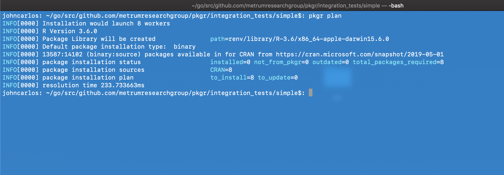

tags: basic, dependencies, cache-system, local-library, clean-cache, clean-pkgdb, inspect, install-type

## Step 1:

## Step 2:

## Step 3:

## Step 4:
### Before

### After

## Step 5:

## Step 6:

## Step 7
### Before

### After

