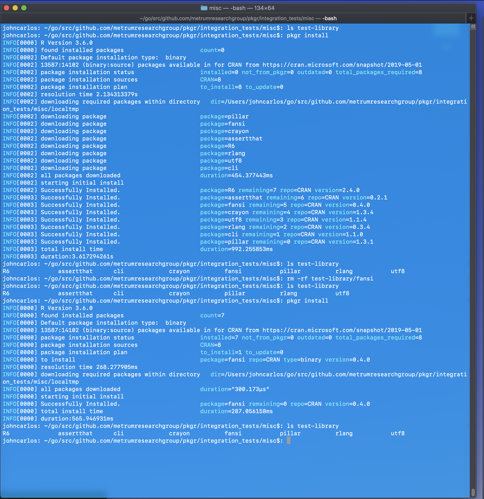
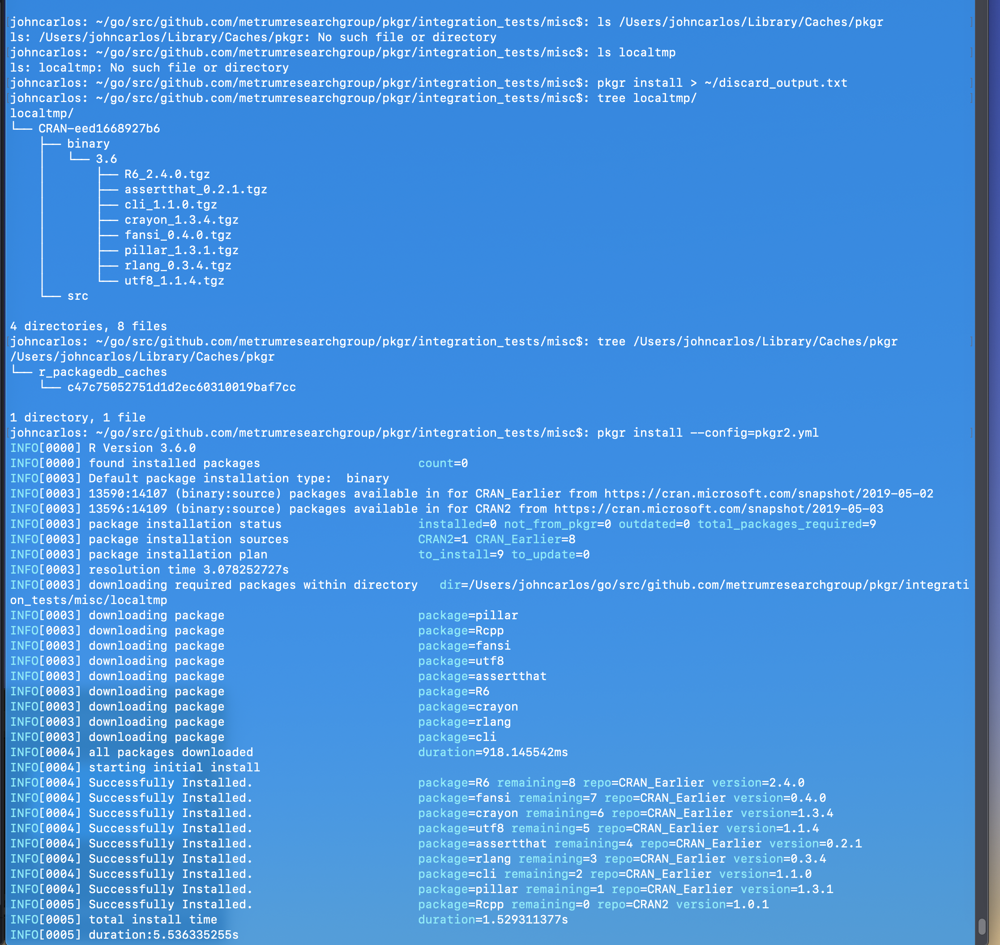

tags: idempotence, cache-partial, cache-extraneous, clean-pkgdb

result: PASS

date_run: 12-03-2019

# Test 1
## Output

# Test 2
## Steps 1, 2, 3

## Steps 4, 5, 6, 7, 8, 9

* Note for step 9: When executing the test, we actually first ran `pkgr clean --all` for the
`pkgr.yml` instead of `pkgr2.yml`. This means that we cleaned out the r_packagedb_caches
for `pkgr.yml` instead of `pkgr2.yml`. However, this still demonstrates the same behavior
that this test was meant to show, i.e. pkgr only removes pkgdbs relevant to the indicated
yaml file. This therefore satisfies this test condition.
* I have updated the test instructions to make this test more clear for future runs (the issue was that the instructions said to just run `pkgr clean --all`, but the intent was to run `pkgr clean --all --config=pkgr2.yml`)
