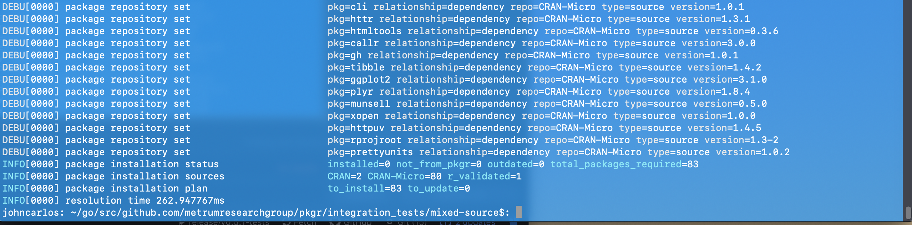
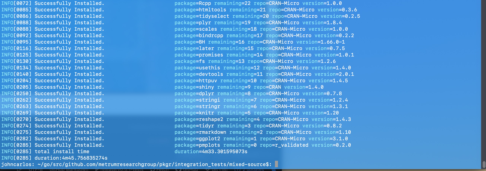

tags: multi-repo, repo-customizations, pkg-customizations, heavy

result: PASS

## Pkgr Plan equivalent to output in guide

Note: `pkgr plan` was run once before this output, which took care of some cacheing.
It looks like the guide did this as well, and that's not what's being tested here,
so this test is still valid.

## Pkgr Install

