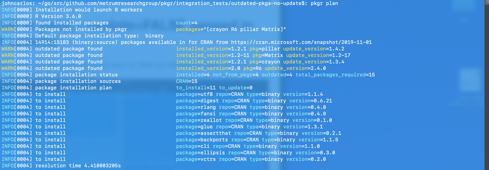
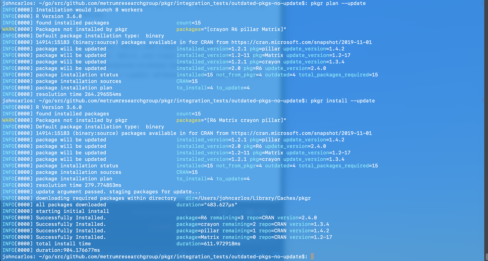

tags: pkg-update, pkg-outdated, command-flags

result: PASS

# Default behavior (nothing specified in yml, no argument passed in) should not update
Note how outdated packages are flagged with warnings in `plan` and excluded from installation in `install`

# `--update` passed in should update
Test run immediately after output from `Update FALSE in yaml, no argument passed in (should not update)`

This test case was run without resetting the environment from the previous test case, which means that only those packages that were not updated were actually installed (since the others were already installed). This is valid.
