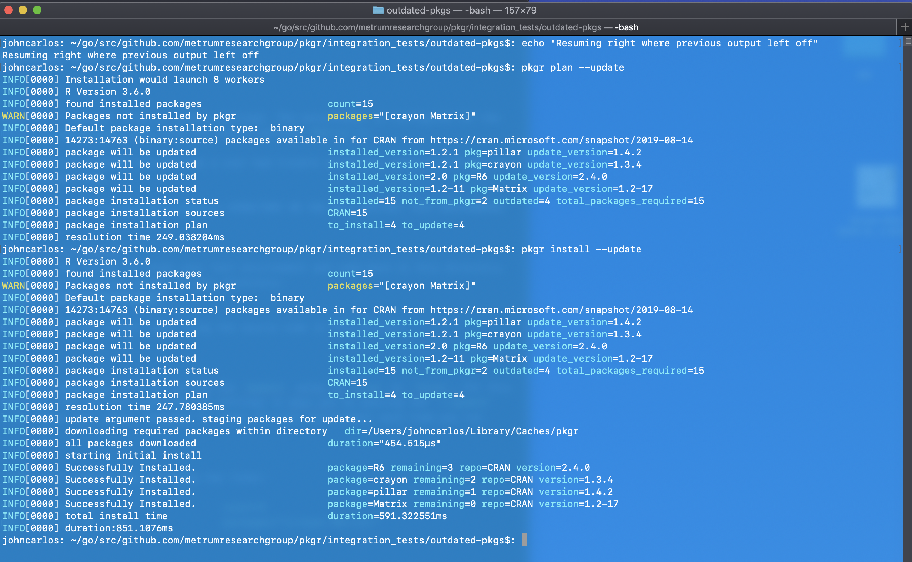
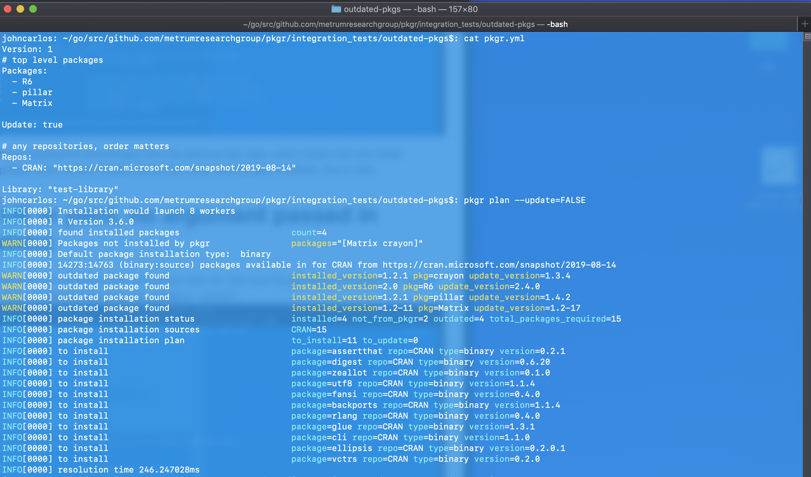
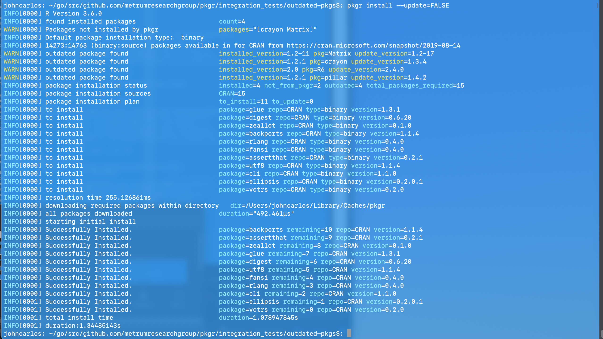

tags: pkg-update, pkg-outdated, plan, existing-pkgs

result:

# Update FALSE in yaml, no argument passed in (should not update)
Note how outdated packages are flagged with warnings in `plan` and excluded from installation in `install`

# Update FALSE in yaml, --update passed in (should update)
Test run immediately after output from `Update FALSE in yaml, no argument passed in (should not update)`

This test case was run without resetting the environment from the previous test case, which means that only those packages that were not updated were actually installed (since the others were already installed). This is valid.

# Update TRUE in yaml, no argument passed in (should update)
Note: environment was reset prior to running this test, but caches were not. See how the packages are flagged for update in `plan` and then successfully installed (which is how we update) in `install`.

# Update TRUE in yaml, --update=FALSE passed in (should not update)
Note: environment was reset prior to running this test, but caches were not. Note how outdated packages are flagged with warnings in `plan` and excluded from installation in `install`

