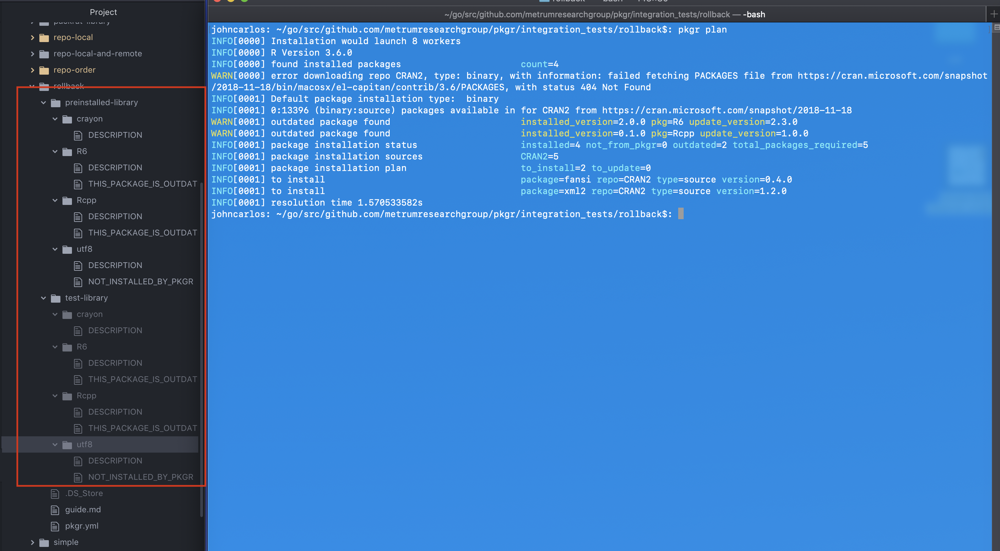
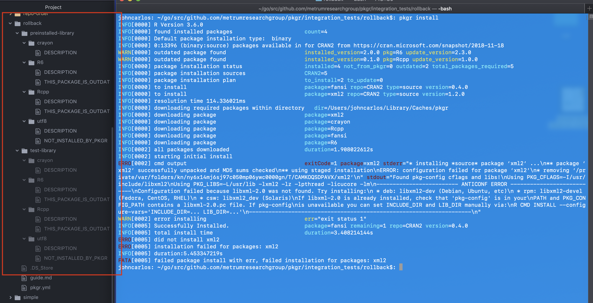
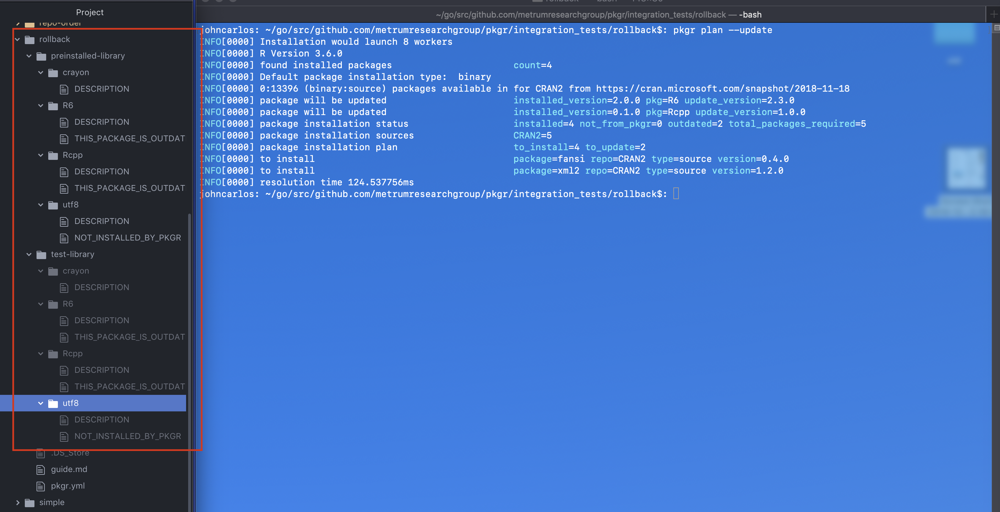
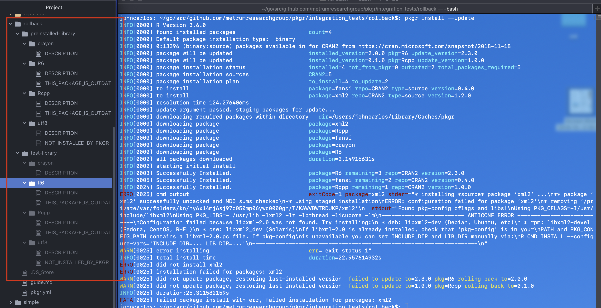

tags: rollback

result: PASS

date_run: 12-03-2019

## pkgr install will fail to install xml2, and after running, test-library will be identical to preinstalled-library
### before

### after is the same

## pkgr install --update will fail to install xml2, and after running, test-library will be identical to preinstalled-library
### before

### after is the same

