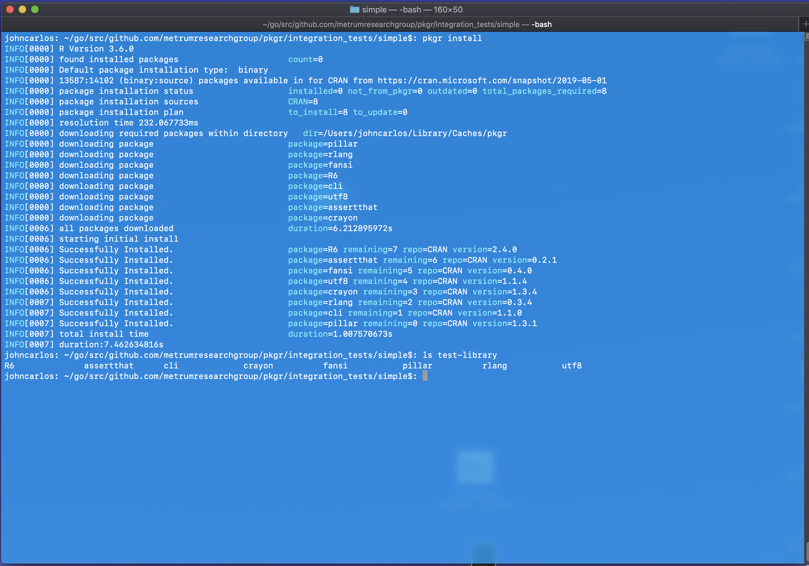
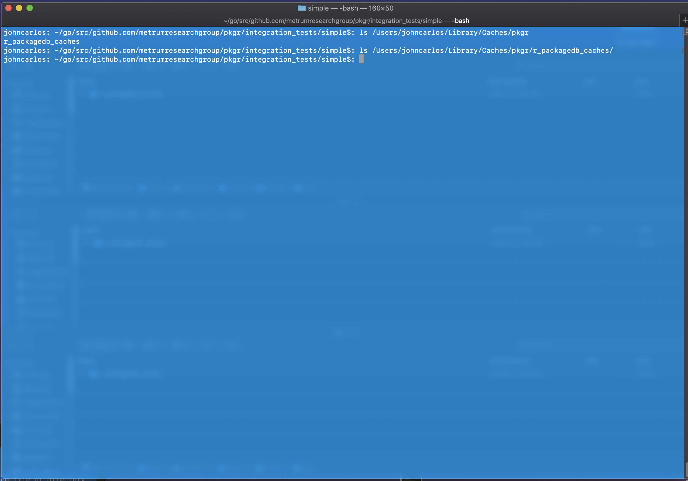
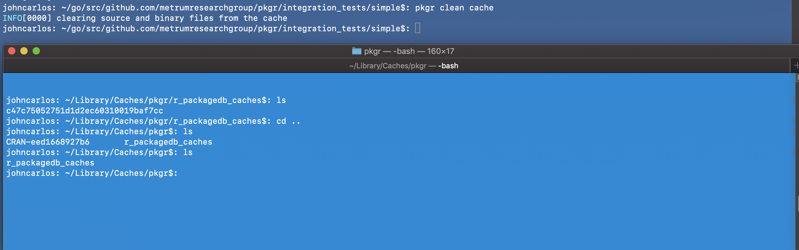
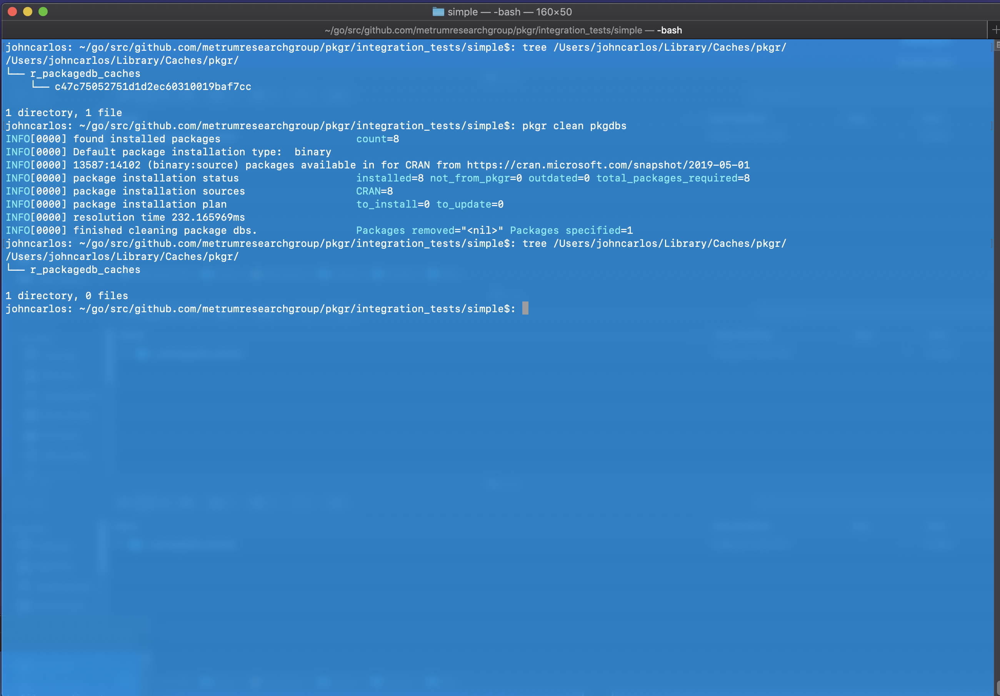
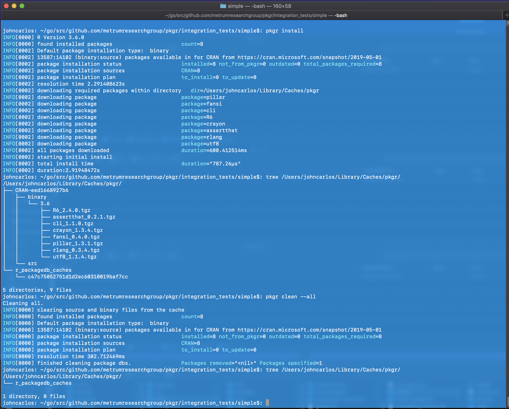

tags: basic, dependencies, cache-system, local-library, clean-cache, clean-pkgdb, inspect, install-type

result: PASS

date_run: 12-02-2019

# Idea
We list the test results in a directory structure like this, store all
screenshots for an integration test in the associated results directory, and
produce a markdown document displaying said screenshots. We also include test
tags in the markdown document, which we then use to match with features. For
each feature, we list which integration tests that feature was verified in and
link them to the results files those integration tests. I believe this can be
done automatically if we write a clever enough script.

## Step 1:

## Step 2:

## Step 3:

## Step 4:
### Before and after (performed a reset after step 3 to show before)

## Step 5:

## Step 6:

## Step 7

