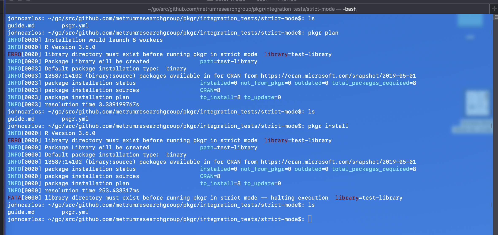

tags: strict-mode

result: PASS

date_run: 12-03-2019

## `plan` indicates via error that library must exist before running in strict-mode. Also, `install` errors fatally, no library is created, and no packages are installed

