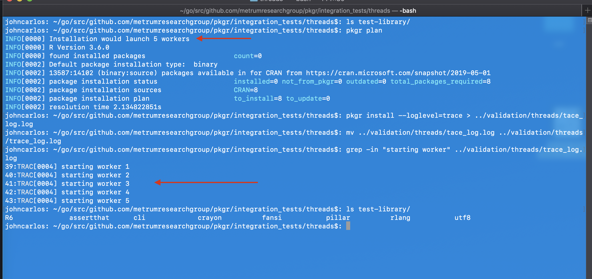

tags: thread-count

result: PASS

## Verify
* `plan` indicates that five threads are to be used.
* `install` installs packages listed in guide, launching five threads to do so.

## Output screenshot

